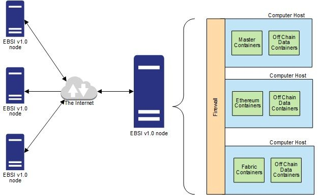

# 0005: Node Hardware Requirements
- Authors: [David Maas](david_maas@hotmail.de) 
- Status: PROPOSED
- Since: 2020-08-12 
- Status Note: Initial Proposal  
- Start Date: 2020-08-12 
- Tags: 

## Summary

Describes the hardware requirements for the node.

## Motivation

For the node to run optimally, certain requirements should be placed on the hardware. 
This is the only way to ensure that there is as little downtime as possible 
and that there are sufficient resources available in the network.

## Examples & Best Practices

##### The following demands are made on the hardware that must be observed during implementation:
- The node must run on server hardware.
- Must have adequate computing power. (16 cores or more)
- Must have sufficient memory. ( 64 GB or more )
- Must have at least 2 TB of storage with the option to grow to 4 TB. 
  For example via Raid implementations. 
  The start partition must also be sufficiently large.
- Must have a high-speed connection to the Internet with highly available, 
  fail-safe lines. 1 Gbps
- Must provide at least one dedicated NIC for consensus traffic 
  and have another NIC to handle external requests. 
  Each NIC must have a stable, static, globally routable IP address.
- A system clock is required that has been proven to be synchronized with known NTP servers.
A power supply unit is required that meets the requirements of a high-availability system.

##### A possible implementation is provided by EBSI. 
European Blockchain Services Infrastructure (EBSI)

Further information is available on the EU website:  
https://ec.europa.eu/cefdigital/wiki/display/CEFDIGITALEBSI/Minimum+Requirements+for+Hosting+an+EBSI+v1.0+Node

It is important to note that the requirements specified in the example implementation need to be adapted according to the network's context. 

## Drawbacks

It is very expensive to build such a hardware infrastructure. 
This would allow potentially interested companies to refrain from.

## Rationale and alternatives

It would be much cheaper to operate nodes privately without guidelines. However, this would also result in the loss of collateral. Presumably the consequence would be more failures. In addition, the overall trust would also be lost. 

## Prior art

The EU and Sovrin provide frameworks and technical documentation that define hardware requirements. 
[Technical Documentation](https://ec.europa.eu/cefdigital/wiki/display/CEFDIGITALEBSI/Technical+Documentation)
[Steward Technical and Orgnaizatoinal Policies](https://sovrin.org/wp-content/uploads/Steward-Technical-and-Organizational-Policies-V2.pdf)

## Unresolved questions

- A constant adaptation of the requirements would still have to be regulated in order 

  to ensure operation in the future. This should be clarified in another RFC.
